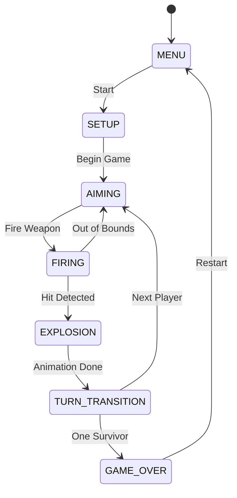
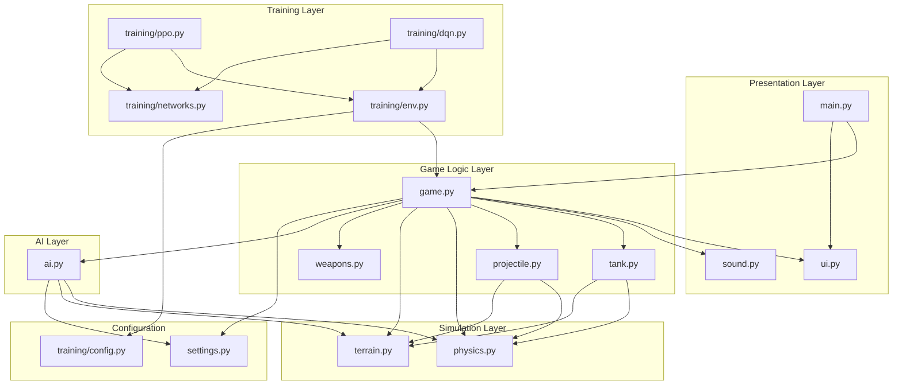

# Scorched Earth MOAG - Architecture and Engineering Document

## Table of Contents
1. [Introduction](#introduction)
2. [Design Philosophy](#design-philosophy)
3. [System Architecture](#system-architecture)
4. [Core Game Engine](#core-game-engine)
5. [Physics and Simulation](#physics-and-simulation)
6. [Terrain System](#terrain-system)
7. [AI Architecture](#ai-architecture)
8. [Reinforcement Learning Infrastructure](#reinforcement-learning-infrastructure)
9. [Audio System](#audio-system)
10. [Performance Engineering](#performance-engineering)
11. [Extension and Modification Guide](#extension-and-modification-guide)

---

## Introduction

Scorched Earth MOAG (Mother Of All Games) is a modern reimplementation of the classic 1991 artillery game. This document describes the architectural decisions, engineering trade-offs, and implementation details that shape the system.

### Project Goals

The project has three primary objectives that drove architectural decisions:

1. **Faithful Gameplay Recreation**: Reproduce the core mechanics of turn-based artillery combat with destructible terrain, variable wind, and weapon variety. This required careful attention to physics simulation and terrain manipulation algorithms.

2. **Machine Learning Training Platform**: Enable reinforcement learning research by providing a headless simulation mode capable of running thousands of games per hour. This fundamentally shaped the separation between game logic and rendering.

3. **Extensibility**: Support easy addition of new weapons, AI strategies, and game modes without modifying core systems. This led to the modular architecture where each subsystem operates through well-defined interfaces.

### Technology Choices

**Pygame** was selected as the rendering framework for several reasons. First, it provides direct access to pixel-level operations needed for destructible terrain. Second, its simple API reduces complexity compared to more sophisticated engines. Third, it runs on all major platforms without compilation. The trade-off is performance - Pygame's software rendering is slower than GPU-accelerated alternatives, but this is acceptable given the game's modest graphical requirements.

**PyTorch** powers the neural network training system. While TensorFlow would work equally well, PyTorch's eager execution model simplifies debugging during RL development. The dynamic computation graph also makes it easier to implement the mixed continuous/discrete action space used in PPO.

**NumPy** handles terrain data and observation processing. Storing terrain heights as a NumPy array enables fast batch operations during training and efficient crater calculations during gameplay.

---

## Design Philosophy

### Separation of Simulation and Presentation

The most important architectural decision is the strict separation between game simulation and visual/audio presentation. The `Game` class can operate in three modes:

- **Normal mode**: Full rendering and sound for human players
- **Headless mode**: No display initialization, silent operation for training
- **Fast mode**: Skips animations and delays while maintaining visual output

This separation exists because reinforcement learning training requires running millions of game steps. At 60 FPS with animations, a single game might take 2-3 minutes. In headless fast mode, the same game completes in under a second. Achieving this 100x+ speedup required ensuring that no game logic depends on rendering state.

The implementation enforces this through conditional guards:

```python
if not self.headless:
    self._render_surface()  # Skip expensive rendering in training

if self.sound:
    self.sound.play('explosion')  # Sound manager is None in headless
```

### State Machine Architecture

Turn-based games naturally map to state machines. Rather than implementing complex conditional logic, the game uses explicit states with clear transitions. This provides several benefits:

1. **Predictability**: Given the current state, only certain actions are valid. The AIMING state accepts angle/power input; the FIRING state ignores it.

2. **Debugging**: State transitions are logged and can be inspected. When something goes wrong, the state history shows exactly how the game arrived at the error condition.

3. **AI Integration**: AI controllers only need to act during AIMING state. They can ignore all other states, simplifying their implementation.

4. **Serialization**: Game state can be saved and restored by recording the current state plus entity positions. This enables replay systems and training checkpointing.

The state machine has seven states, each with specific responsibilities:



**MENU** and **SETUP** handle pre-game configuration. The setup screen allows selecting player count (2-4), player types (human or AI), and AI difficulty levels. These states exist outside the core game loop and reset all game state when transitioning to AIMING.

**AIMING** is where players (human or AI) adjust their firing parameters. Human players use keyboard input to modify angle and power. AI players run their decision algorithms and animate their aiming to provide visual feedback. The state persists until a fire command is issued.

**FIRING** runs the projectile simulation. Physics are applied each frame, and collision detection checks both terrain and tanks along the projectile's path. This state ends when the projectile hits something or leaves the play area.

**EXPLOSION** handles the visual explosion animation and applies game effects: terrain destruction, damage calculation, and tank health updates. In fast mode, this state is skipped entirely - effects are applied immediately without animation.

**TURN_TRANSITION** provides a brief pause between turns, displays the next player indicator, and randomizes wind for the upcoming turn. In fast mode, this state has zero duration.

**GAME_OVER** displays the winner and waits for player input to return to the menu.

### Entity-Component Separation

Rather than using a full entity-component-system (ECS) architecture, which would be overkill for this game's complexity, the codebase uses a simplified approach: entities (tanks, projectiles, explosions) are standalone objects, and systems (physics, rendering, collision) operate on collections of these entities.

The `Game` class acts as the coordinator, maintaining lists of active entities and calling the appropriate system methods during each update cycle. This is simpler than ECS while still achieving the decoupling benefits for a game of this scale.

---

## System Architecture

### Module Dependency Graph

The codebase is organized into layers with controlled dependencies. Lower layers have no knowledge of higher layers, enabling testing and reuse.



**Configuration Layer** (`settings.py`, `training/config.py`): Contains all constants, hyperparameters, and tunable values. No logic, only data. This layer is imported by nearly everything else.

**Simulation Layer** (`physics.py`, `terrain.py`): Pure simulation code with no dependencies on game rules. The physics module applies gravity and wind to any object with position and velocity. The terrain module manages height data and geometric operations. These modules could be reused in an entirely different game.

**Game Logic Layer** (`game.py`, `tank.py`, `projectile.py`, `weapons.py`): Implements game rules and entity behavior. Tanks know about health and aiming. Projectiles know about collision and explosion triggering. Weapons define damage and special effects. The Game class orchestrates everything.

**AI Layer** (`ai.py`): Implements decision-making for computer-controlled tanks. Depends on game entities and simulation but not on presentation. The AI can run identically whether the game is visible or headless.

**Presentation Layer** (`main.py`, `ui.py`, `sound.py`): Handles all human-facing I/O. The main module initializes Pygame and runs the game loop. UI renders all visual elements. Sound generates and plays audio. These modules are completely unused during headless training.

**Training Layer** (`training/*.py`): Wraps the game in a reinforcement learning interface. The environment module presents the game as a Gym-compatible step/reset interface. Network modules define neural architectures. PPO and DQN modules implement training algorithms. This layer only depends on the game logic layer and configuration.

### File-by-File Responsibilities

**main.py** (55 lines): Minimal entry point. Initializes Pygame and its mixer, creates the display surface, instantiates the Game object, and runs the standard game loop (handle events, update, render, flip). The loop calculates delta time from the clock to ensure frame-rate-independent physics.

**game.py** (520 lines): Central coordinator implementing the state machine. Manages collections of tanks, projectiles, and explosions. Routes input events to the appropriate handler based on current state. Coordinates AI controllers. Handles turn advancement and victory detection. The largest and most complex module because it connects everything else.

**settings.py** (131 lines): All game constants in one place. Screen dimensions (1024x768), physics values (gravity 500 px/s^2, wind -8 to +8), entity parameters (tank health 100, angle range 0-180), color definitions, and AI difficulty settings. Changing game balance typically requires only editing this file.

**terrain.py** (204 lines): Procedural terrain generation using midpoint displacement algorithm, which recursively subdivides the terrain and adds random offsets at midpoints. The result is naturalistic hills and valleys. Stores height at each x-coordinate (1024 values). Provides circle destruction for explosions (carves out terrain) and circle addition for dirt balls (builds up terrain). In visual mode, pre-renders the terrain to a surface with gradient coloring for efficiency.

**tank.py** (236 lines): Tank entity with position, health, angle, power, and weapon state. Calculates turret endpoint for projectile spawning. Computes firing velocity from angle and power. Handles falling when terrain is removed underneath. Detects hits from explosions using box-circle intersection. Renders tank body, dome, turret, and health bar.

**projectile.py** (312 lines): Projectile entity with position, velocity, and trail history. Updates position using physics each frame. Implements sub-stepping collision detection to prevent fast projectiles from tunneling through thin terrain or tanks. Handles MIRV splitting at trajectory apex. Creates explosion objects on impact.

**physics.py** (141 lines): Stateless physics utilities. Applies gravity and wind to projectile velocity. Calculates damage falloff from explosion center. Predicts trajectories for AI targeting. Checks bounds for projectile removal.

**weapons.py** (96 lines): Weapon definitions as data objects. Each weapon has name, damage, explosion radius, projectile color, and optional special effect. Five weapons: Standard Shell (balanced), Big Bertha (large radius), Baby Nuke (high damage), Dirt Ball (adds terrain instead of destroying it), and MIRV (splits into five sub-projectiles).

**ai.py** (500 lines): Two AI implementations. The heuristic `AI` class calculates shots using projectile physics equations, chooses targets by proximity, and adds difficulty-based random error. The `RLAgent` class loads trained PyTorch models and queries them for actions, falling back to heuristic AI if no model is available. Includes direction correction logic to handle the fact that RL models are trained only from player 0's perspective.

**ui.py** (319 lines): All visual rendering except entities. Draws menus with title and instructions. Renders HUD with player indicator, weapon name, angle/power gauges, and wind indicator. Displays turn transition overlays and game-over screens. Uses Pygame's font rendering for all text.

**sound.py** (646 lines): Procedural audio generation. The `SoundGenerator` class synthesizes sound effects using numpy waveform mathematics - combining sine waves, noise, and envelopes to create explosions, weapon fires, and UI feedback. The `MusicGenerator` creates ambient background music using chord progressions. The `SoundManager` coordinates playback and handles enable/disable toggling.

---

## Core Game Engine

### The Game Loop

The main loop in `main.py` follows the standard pattern for real-time games:

```python
while running:
    dt = clock.tick(FPS) / 1000.0  # Delta time in seconds

    for event in pygame.event.get():
        if event.type == pygame.QUIT:
            running = False
        else:
            game.handle_event(event)

    game.update(dt)
    game.render(screen)
    pygame.display.flip()
```

Delta time (`dt`) is crucial for frame-rate-independent behavior. All movement and timing uses `dt` as a multiplier, so the game behaves identically whether running at 30 FPS on slow hardware or 144 FPS on fast hardware. A tank rotating at 60 degrees per second moves `60 * dt` degrees each frame.

The loop separates three concerns:

1. **Event Handling**: Discrete events like key presses are processed immediately. The game routes events to state-specific handlers. A spacebar press in MENU state starts the game; in AIMING state, it fires.

2. **Update**: Continuous simulation advances by `dt` seconds. Physics are applied, AI makes decisions, animations progress, timers count down.

3. **Render**: The current state is drawn to the screen buffer. This happens every frame even if nothing changed, ensuring visual consistency.

### Event Routing

Events flow through a hierarchical dispatch system. The `handle_event` method checks event type and routes to appropriate handlers:

```python
def handle_event(self, event):
    if event.type == pygame.KEYDOWN:
        self.keys_held[event.key] = True
        self._handle_keydown(event)
    elif event.type == pygame.KEYUP:
        self.keys_held[event.key] = False

def _handle_keydown(self, event):
    if self.state == GameState.MENU:
        self._handle_menu_input(event)
    elif self.state == GameState.AIMING:
        self._handle_aiming_input(event)
    # ... etc
```

The `keys_held` dictionary tracks which keys are currently pressed. This enables smooth continuous input - holding the left arrow key continuously increases the tank's angle, rather than requiring repeated presses.

### Turn Management

Turn-based gameplay requires careful sequencing. After each shot resolves, the game must:

1. Check if the game is over (one or zero tanks alive)
2. Find the next alive player (skipping destroyed tanks)
3. Randomize wind for the new turn
4. Initialize the AI controller if the next player is computer-controlled
5. Display the turn transition

The `_next_turn` method handles this sequence:

```python
def _next_turn(self):
    alive_tanks = [t for t in self.tanks if t.alive]
    if len(alive_tanks) <= 1:
        self.state = GameState.GAME_OVER
        return

    # Find next alive player (may skip destroyed tanks)
    for _ in range(len(self.tanks)):
        self.current_player_index = (self.current_player_index + 1) % len(self.tanks)
        if self.tanks[self.current_player_index].alive:
            break

    self.physics.randomize_wind()

    current_tank = self._get_current_tank()
    if current_tank.is_ai:
        self.ai_controllers[current_tank.player_id].start_turn(...)

    self.state = GameState.TURN_TRANSITION
```

### Collision Detection

Collision detection happens at two levels: terrain and tanks.

**Terrain collision** checks if a point is below the terrain surface:

```python
def check_collision(self, x, y):
    if x < 0 or x >= SCREEN_WIDTH:
        return False
    terrain_y = SCREEN_HEIGHT - self.heights[x]
    return y >= terrain_y
```

This is efficient (O(1) lookup) but only works for point queries. The terrain is treated as a heightfield - solid below the surface, empty above.

**Tank collision** uses box-circle intersection. Tanks are rectangular, but explosions and projectiles are treated as circles:

```python
def check_hit(self, x, y, radius):
    # Find closest point on tank rectangle to circle center
    closest_x = max(tank_left, min(x, tank_right))
    closest_y = max(tank_top, min(y, tank_bottom))

    # Check if closest point is within circle
    distance = sqrt((x - closest_x)**2 + (y - closest_y)**2)
    return distance <= radius
```

**Sub-stepping** prevents tunneling - fast projectiles skipping through thin obstacles. Rather than checking collision only at the current position, the projectile checks along its entire path from the previous frame:

```python
def _check_terrain_along_path(self, terrain):
    dx = self.x - self.prev_x
    dy = self.y - self.prev_y
    distance = sqrt(dx*dx + dy*dy)
    steps = max(1, int(distance / 5))  # Check every 5 pixels

    for i in range(steps + 1):
        t = i / steps
        check_x = self.prev_x + dx * t
        check_y = self.prev_y + dy * t
        if terrain.check_collision(check_x, check_y):
            return (check_x, check_y)
    return None
```

This ensures that a projectile moving 50 pixels per frame will check 10 points along its path, catching collisions that instantaneous checking would miss.

---

## Physics and Simulation

### Projectile Motion

The physics system implements Euler integration for projectile motion. Each frame, velocity is updated by applied forces, then position is updated by velocity:

```python
def apply_to_projectile(self, projectile, dt):
    # Apply wind (horizontal force)
    projectile.vx += self.wind * 10 * dt

    # Apply gravity (vertical force)
    projectile.vy += self.gravity * dt

    # Update position
    projectile.x += projectile.vx * dt
    projectile.y += projectile.vy * dt
```

The wind multiplier (10) was tuned empirically. Raw wind values (-8 to +8) felt too weak at affecting trajectories, so wind effect is amplified 10x when applied as acceleration.

Euler integration has known stability issues at large timesteps, but the game runs at 60 FPS (dt = 0.0167s), keeping timesteps small enough for stable simulation. Higher-order integrators like Runge-Kutta would provide better accuracy but aren't necessary for this application.

### Damage Calculation

Explosion damage uses linear falloff from center to edge:

```python
def calculate_damage(self, distance, max_damage, explosion_radius):
    if distance >= explosion_radius:
        return 0

    damage_ratio = 1 - (distance / explosion_radius)
    return int(max_damage * damage_ratio)
```

A tank at the center of a Baby Nuke explosion (75 damage, 80 radius) takes full 75 damage. At 40 pixels away (half the radius), it takes 37 damage. At the edge, it takes near-zero damage.

This model rewards accuracy while still punishing near-misses. It also creates interesting tactical situations where a powerful weapon can damage multiple grouped enemies.

### Wind Mechanics

Wind is randomized at the start of each turn, ranging from -8 (strong left) to +8 (strong right). This introduces uncertainty that prevents players from memorizing exact firing solutions.

Wind affects horizontal velocity continuously throughout flight. A projectile flying for 2 seconds with +4 wind gains 80 pixels/second of rightward velocity by the end, significantly curving its trajectory.

Players must compensate for wind when aiming. Shooting into the wind requires more power or a more vertical angle. Shooting with the wind requires less power or risking overshoot.

### Coordinate System Details

The game uses screen coordinates where (0,0) is the top-left corner and Y increases downward. This matches Pygame's coordinate system but inverts the usual mathematical convention.

Terrain heights are stored as "height from bottom" - larger values mean taller mountains. Converting to screen Y requires subtraction: `screen_y = SCREEN_HEIGHT - height`.

Angles use mathematical convention: 0 degrees points right (positive X), 90 degrees points up (negative Y in screen coordinates), 180 degrees points left. This matches trigonometric functions: `vx = cos(angle) * power`, `vy = -sin(angle) * power` (negated because screen Y is inverted).

---

## Terrain System

### Procedural Generation

Terrain is generated using the midpoint displacement algorithm, a classic technique for creating naturalistic heightfields. The algorithm works recursively:

1. Start with two endpoints at random heights
2. Find the midpoint and set its height to the average of the endpoints plus random displacement
3. Recursively apply to both halves, reducing displacement magnitude each level
4. Continue until resolution matches screen width

```python
def _midpoint_displacement(self, left, right, roughness):
    if right - left < 2:
        return

    mid = (left + right) // 2
    avg = (self.heights[left] + self.heights[right]) / 2
    displacement = (right - left) * roughness * random.uniform(-0.5, 0.5)
    self.heights[mid] = int(avg + displacement)

    self._midpoint_displacement(left, mid, roughness * 0.9)
    self._midpoint_displacement(mid, right, roughness * 0.9)
```

The roughness parameter (0.5) controls terrain bumpiness. Higher values create more jagged terrain; lower values create smoother hills. The 0.9 decay factor reduces displacement at finer scales, preventing terrain from becoming too noisy.

After generation, a smoothing pass averages neighboring heights to remove sharp spikes that would look unnatural or cause gameplay issues.

### Destruction Algorithm

When an explosion occurs, terrain is destroyed in a circular pattern. The algorithm iterates over X coordinates within the blast radius and calculates how much terrain to remove at each column:

```python
def destroy_circle(self, center_x, center_y, radius):
    for x in range(center_x - radius, center_x + radius + 1):
        dx = x - center_x
        if abs(dx) > radius:
            continue

        # Height of circle at this x position
        half_height = sqrt(radius*radius - dx*dx)
        circle_bottom_y = center_y + half_height

        # Remove terrain above circle bottom
        current_surface_y = SCREEN_HEIGHT - self.heights[x]
        if current_surface_y < circle_bottom_y:
            new_height = SCREEN_HEIGHT - circle_bottom_y
            self.heights[x] = max(0, int(new_height))
```

This creates circular craters. The crater depth varies across its width - deepest at center, tapering to zero at the edges. Multiple overlapping explosions create complex crater patterns.

The Dirt Ball weapon uses similar logic but adds terrain instead of removing it, allowing players to build defensive walls or bury enemies.

### Rendering Optimization

Drawing terrain pixel-by-pixel every frame would be prohibitively slow. Instead, the terrain is pre-rendered to a surface that can be blitted in a single operation:

```python
def _render_surface(self):
    self.surface = pygame.Surface((SCREEN_WIDTH, SCREEN_HEIGHT), pygame.SRCALPHA)

    for x in range(SCREEN_WIDTH):
        height = self.heights[x]
        terrain_top = SCREEN_HEIGHT - height

        # Green grass layer on top
        pygame.draw.line(self.surface, COLORS['terrain_grass'],
                        (x, terrain_top), (x, terrain_top + 3))

        # Gradient fill below
        for y in range(terrain_top + 3, SCREEN_HEIGHT):
            depth_ratio = (y - terrain_top) / height
            color = lerp_color(COLORS['terrain_top'],
                              COLORS['terrain_bottom'], depth_ratio)
            self.surface.set_at((x, y), color)
```

This pre-rendering is the most expensive operation in the game - iterating over 768,000 pixels with color interpolation. In normal gameplay, it only happens after explosions modify the terrain, which is acceptable. But during RL training with many explosions per second, this became a critical bottleneck.

The solution was adding a `headless` flag to skip rendering entirely during training:

```python
if modified and not self.headless:
    self._render_surface()  # Skip in training mode
```

This optimization provided a 100x+ speedup for training, as terrain modification went from ~800ms to ~1ms per explosion.

---

## AI Architecture

### Heuristic AI Design

The heuristic AI uses physics-based shot calculation rather than pattern matching or lookup tables. This makes it effective across all terrain configurations and adapts naturally to changing wind conditions.

**Target Selection**: The AI chooses the closest alive enemy. This is a simple heuristic that works well because closer targets are easier to hit and pose more immediate threat. A more sophisticated AI might consider target health, position vulnerability, or threat assessment.

```python
def _choose_target(self, tanks):
    enemies = [t for t in tanks if t != self.tank and t.alive]
    if not enemies:
        return None

    closest = min(enemies, key=lambda e: abs(e.x - self.tank.x))
    return closest
```

**Shot Calculation**: Given a target, the AI calculates the required angle and power using the projectile range formula. For a projectile launched at angle theta with velocity v:

```
Range = v^2 * sin(2*theta) / g
```

Rearranging to solve for velocity given range and angle:

```
v = sqrt(Range * g / sin(2*theta))
```

The AI uses fixed angles (45 degrees for rightward shots, 135 for leftward) and calculates power to achieve the required range. This isn't optimal - variable angles could achieve better accuracy - but it's simple and works well enough.

```python
def _calculate_shot(self, target, terrain, physics):
    dx = target.x - self.tank.x
    distance = abs(dx)

    base_angle = 45 if dx > 0 else 135
    angle_rad = math.radians(base_angle)
    sin_2theta = math.sin(2 * angle_rad)

    estimated_power = sqrt(distance * GRAVITY / sin_2theta)

    # Wind compensation
    if (dx > 0 and physics.wind < 0) or (dx < 0 and physics.wind > 0):
        estimated_power *= 1.1  # Fighting wind
    else:
        estimated_power *= 0.9  # With wind

    return base_angle, estimated_power
```

**Difficulty Implementation**: Rather than using different algorithms for different difficulties, the AI adds random error to its calculated solution:

```python
angle_error = random.uniform(-settings['angle_error'], settings['angle_error'])
power_error = random.uniform(-settings['power_error'], settings['power_error'])

self.target_angle = calculated_angle + angle_error
self.target_power = calculated_power + power_error
```

Easy AI adds up to +/-15 degrees and +/-50 power, making its shots wildly inaccurate. Hard AI adds only +/-3 degrees and +/-10 power, making it nearly precise. This approach is more predictable than having separate algorithms and allows smooth difficulty scaling.

**Weapon Selection**: Weapons are chosen based on target distance. At long range, the AI uses Standard Shell or Big Bertha. At medium range, it might use Baby Nuke for extra damage. At close range, it avoids high-damage weapons to prevent self-damage. There's also a small random chance to use MIRV for variety.

### RLAgent Integration

The RLAgent class bridges trained neural network models with the game's AI interface. It presents the same interface as heuristic AI but delegates decisions to PyTorch models.

**Model Loading**: On initialization, RLAgent searches for model checkpoints:

```python
default_paths = [
    os.path.join('models', f'{algorithm}_best.pt'),
    os.path.join('models', f'{algorithm}_latest.pt'),
]
for path in default_paths:
    if os.path.exists(path):
        self._load_model(path)
        break
```

If no model is found, RLAgent falls back to heuristic AI. This ensures the game remains playable even without trained models.

**Observation Building**: The agent constructs observation vectors matching the training environment's format:

```python
def _build_observation(self, tanks, terrain, physics):
    terrain_obs = np.array(terrain.heights) / TERRAIN_MAX_HEIGHT

    player_features = np.array([
        self.tank.x / SCREEN_WIDTH,
        self.tank.y / SCREEN_HEIGHT,
        self.tank.health / TANK_MAX_HEALTH,
        self.tank.angle / ANGLE_MAX,
        (self.tank.power - POWER_MIN) / (POWER_MAX - POWER_MIN),
        self.tank.current_weapon / 4.0,
    ])

    # ... opponent features and wind

    return {'terrain': terrain_obs, 'player_tank': player_features, ...}
```

All values are normalized to [0, 1] or [-1, 1] ranges, matching the training preprocessing.

**Direction Correction**: A critical issue emerged when deploying trained models: they were trained exclusively as Player 0, who typically occupies the left side of the screen. When used for Player 1 (right side), the model would aim in the wrong direction.

The fix detects when the model's output angle doesn't match the target direction and mirrors it:

```python
target = self._find_target(tanks)
dx = target.x - self.tank.x
aims_right = self.target_angle < 90
target_is_right = dx > 0

if aims_right != target_is_right:
    self.target_angle = 180 - self.target_angle
```

If the model outputs 30 degrees (aiming right) but the target is to the left, the angle is corrected to 150 degrees (aiming left).

**Weapon Exclusion**: The Dirt Ball weapon (index 3) adds terrain instead of dealing damage. Untrained or poorly-trained models often select it randomly, creating frustrating gameplay where the AI buries itself. RLAgent forcibly replaces Dirt Ball selection with Standard Shell:

```python
if self.tank.current_weapon == 3:
    self.tank.current_weapon = 0
```

This is a pragmatic workaround until models are trained well enough to use Dirt Ball strategically.

---

## Reinforcement Learning Infrastructure

### Environment Design

The `ScorchedEarthEnv` class wraps the game in the Gym-style interface expected by RL algorithms. This involves translating between the game's object-oriented state and the flat tensor format neural networks expect.

**Observation Space**: The observation is a dictionary of NumPy arrays:

- `terrain`: 1024 float values representing normalized terrain heights
- `player_tank`: 6 floats for position, health, angle, power, weapon
- `opponent_tanks`: 12 floats for up to 3 opponents (4 features each)
- `wind`: 1 float for normalized wind

This totals 1043 input features. The terrain dominates the observation, which motivated using a CNN encoder rather than treating all features uniformly.

**Action Space**: Actions are dictionaries with three components:

- `angle`: Continuous value from 0 to 180
- `power`: Continuous value from 50 to 500
- `weapon`: Discrete value from 0 to 4

PPO handles this mixed continuous/discrete space directly using separate distribution heads. DQN discretizes everything into 950 actions (19 angle bins * 10 power bins * 5 weapons).

**Reward Function**: The reward structure encourages aggressive, efficient play:

```python
def _calculate_reward(self):
    reward = 0.0

    # Reward damage dealt to opponents
    for tank in opponent_tanks:
        damage_dealt = prev_health[tank] - tank.health
        if damage_dealt > 0:
            reward += damage_dealt * 0.1

        # Bonus for kills
        if was_alive[tank] and not tank.alive:
            reward += 5.0

    # Penalty for self-damage
    self_damage = prev_self_health - self.tank.health
    reward -= self_damage * 0.05

    # Win/lose bonuses
    if game_over:
        if agent_won:
            reward += 20.0
        else:
            reward -= 10.0

    # Small step penalty to encourage efficiency
    reward -= 0.01

    return reward
```

The asymmetry between win bonus (+20) and lose penalty (-10) was intentional. Early experiments with symmetric rewards led to overly conservative play - agents would avoid risky shots to minimize chance of losing, even when aggression was optimal.

### Training Loop Architecture

**PPO Training**: Proximal Policy Optimization collects rollouts of experience, then performs multiple optimization passes over that data before discarding it:

```python
def train_ppo(env, agent, total_steps, n_steps):
    obs = env.reset()

    while steps < total_steps:
        # Collect n_steps of experience
        for _ in range(n_steps):
            action, log_prob, value = agent.select_action(obs)
            next_obs, reward, done, info = env.step(action)
            agent.store_transition(obs, action, reward, value, log_prob, done)
            obs = next_obs if not done else env.reset()

        # Compute advantages using GAE
        returns, advantages = compute_gae(agent.buffer, last_value)

        # Multiple optimization epochs
        for epoch in range(n_epochs):
            for batch in agent.buffer.get_batches():
                loss = compute_ppo_loss(batch, advantages)
                optimizer.step(loss)

        agent.buffer.clear()
```

The key PPO hyperparameters are:

- `n_steps=2048`: Steps per rollout. Larger values provide more stable gradients but slower iteration.
- `n_epochs=10`: Optimization passes per rollout. More epochs squeeze more learning from each rollout but risk overfitting.
- `clip_epsilon=0.2`: Limits how much the policy can change per update, preventing destructive updates.

**DQN Training**: Deep Q-Network learns continuously from a replay buffer, sampling past experiences to break temporal correlation:

```python
def train_dqn(env, agent, total_steps):
    obs = env.reset()

    for step in range(total_steps):
        # Epsilon-greedy action selection
        epsilon = get_epsilon(step)
        if random.random() < epsilon:
            action = random_action()
        else:
            action = agent.get_best_action(obs)

        next_obs, reward, done, info = env.step(action)
        agent.buffer.push(obs, action, reward, next_obs, done)

        # Learn from random batch
        if len(agent.buffer) >= learning_starts:
            batch = agent.buffer.sample(batch_size)
            loss = compute_td_loss(batch)
            optimizer.step(loss)

            # Periodically update target network
            if step % target_update_freq == 0:
                target_network.load_state_dict(q_network.state_dict())

        obs = next_obs if not done else env.reset()
```

Key DQN components:

- **Replay Buffer**: Stores 100,000 transitions, randomly sampling batches of 32 for training. Breaks correlation between consecutive experiences.
- **Target Network**: A frozen copy of the Q-network used to compute TD targets. Updated every 1000 steps to prevent oscillation.
- **Double DQN**: Uses online network to select actions but target network to evaluate them, reducing overestimation bias.
- **Prioritized Replay**: Samples high TD-error transitions more frequently, focusing learning on surprising experiences.

### Neural Network Architecture

The network architecture was designed to handle the heterogeneous observation space efficiently.

**Terrain Encoder**: The 1024-element terrain array is processed by a 1D CNN that progressively reduces spatial resolution while increasing feature depth:

```
Input: 1024 values
Conv1d(32 filters, kernel=8, stride=4) -> 255 positions
Conv1d(64 filters, kernel=4, stride=2) -> 126 positions
Conv1d(64 filters, kernel=3, stride=2) -> 62 positions
Flatten -> 3968 features
```

CNNs are appropriate here because terrain exhibits spatial locality - nearby heights are correlated, and the network should learn patterns like "peak," "valley," and "cliff" regardless of position.

**Tank Encoder**: The 19 non-terrain features (player + opponents + wind) are processed by a simple MLP:

```
Input: 19 values
Linear(256) + ReLU
Linear(256) + ReLU
Output: 256 features
```

These features don't have spatial structure, so a fully-connected network is appropriate.

**Shared Layers**: Terrain and tank encodings are concatenated and passed through shared layers that learn cross-modal relationships:

```
Concatenate: 3968 + 256 = 4224 features
Linear(256) + ReLU
Linear(256) + ReLU
```

**Output Heads**: For PPO, separate heads produce each output:

- Angle mean: Linear(1) + Sigmoid * 180
- Angle log-std: Learnable parameter
- Power mean: Linear(1) + Sigmoid * 450 + 50
- Power log-std: Learnable parameter
- Weapon logits: Linear(5)
- Value: Linear(1)

For DQN, a single head produces Q-values for all 950 discrete actions, using dueling architecture that separates value and advantage estimation.

---

## Audio System

### Procedural Sound Generation

Rather than loading audio files, the game synthesizes all sounds using mathematical waveforms. This eliminates external dependencies and ensures consistent audio across platforms.

The `SoundGenerator` class creates sounds by combining basic waveforms:

**Sine waves** provide pure tones for musical elements and resonant frequencies:

```python
def _generate_sine(self, freq, duration, amplitude=1.0):
    t = np.linspace(0, duration, int(self.sample_rate * duration))
    return amplitude * np.sin(2 * np.pi * freq * t)
```

**White noise** provides texture for explosions and impacts:

```python
def _generate_noise(self, duration):
    return np.random.uniform(-1, 1, int(self.sample_rate * duration))
```

**ADSR envelopes** shape sound evolution over time (Attack, Decay, Sustain, Release):

```python
def _apply_envelope(self, samples, attack, decay, sustain, release):
    # Ramp up during attack
    # Ramp down to sustain level during decay
    # Hold at sustain level
    # Ramp to zero during release
```

**Example - Explosion Sound**:

```python
def _generate_explosion(self, duration=0.5, intensity=1.0):
    # Base noise with exponential decay
    noise = self._generate_noise(duration)
    decay = np.exp(-np.linspace(0, 8/intensity, len(noise)))

    # Low frequency rumble
    rumble = self._generate_sine(60*intensity, duration, 0.5)
    rumble += self._generate_sine(40*intensity, duration, 0.3)

    # Initial crack/pop
    pop = self._generate_noise(0.02) * 1.5

    # Combine layers
    samples = (noise * 0.7 + rumble * 0.5) * decay
    samples[:len(pop)] += pop * np.exp(-np.linspace(0, 5, len(pop)))

    # Lowpass filter for realism
    samples = self._lowpass_filter(samples, 0.1 + intensity*0.1)

    return self._make_sound(samples * 0.8)
```

This creates a sound with an initial crack, followed by rumbling noise that decays over time. The `intensity` parameter scales frequency and decay rate - larger explosions have lower frequencies and longer duration.

### Music Generation

Background music is generated using simple chord progressions. The menu uses ambient pads with slow chord changes; battle music adds rhythmic bass pulses.

```python
def generate_battle_music(self, duration=60.0):
    # Bass pulse at 120 BPM
    beat_duration = 0.5
    bass_notes = [D2, F2, G2, A2]  # D minor

    for beat in range(num_beats):
        note = bass_notes[beat % 4]
        tone = sine(note_to_freq(note), beat_duration)
        tone *= exponential_decay
        samples[beat_position:] += tone

    # Pad layer with longer notes
    pad_notes = [D3, F3, A3, D4]
    # ... similar pattern with slower changes
```

The result isn't sophisticated music, but it provides appropriate atmosphere without requiring audio assets.

---

## Performance Engineering

### Training Speed Optimization

Initial training ran at approximately 0.5 steps per second - far too slow for the million-step training runs needed for RL. Profiling revealed that terrain surface rendering consumed 99.9% of execution time.

The solution involved three changes:

1. **Headless terrain mode**: Skip `_render_surface()` when `headless=True`. Terrain heights are still modified, but no pixels are drawn.

2. **Larger timesteps**: Training uses `dt=0.1` (10 FPS equivalent) instead of `dt=0.0167` (60 FPS). This is acceptable because training doesn't need smooth animation.

3. **Instant turn transitions**: Set `turn_transition_duration=0` in fast mode, eliminating the 1-second pause between turns.

These changes increased training speed to 100-800 steps per second, a 200-1600x improvement.

### Memory Management

The replay buffer caps at 100,000 transitions to prevent unbounded memory growth. Each transition stores:

- Observation: ~8KB (terrain array + features)
- Action: 24 bytes
- Reward, done, next_obs: ~8KB

Total per transition: ~16KB. Buffer at capacity: ~1.6GB.

This is manageable on most systems, but could be reduced by:
- Compressing terrain (run-length encoding)
- Storing deltas instead of full observations
- Using memory-mapped storage for larger buffers

### GPU Utilization

Neural network operations automatically use GPU when available via PyTorch's device management:

```python
self.device = torch.device('cuda' if torch.cuda.is_available() else 'cpu')
self.network.to(self.device)
```

Observations are moved to GPU only when needed for training, minimizing CPU-GPU data transfer:

```python
def obs_to_tensor(obs, device):
    return {
        'terrain': torch.tensor(obs['terrain'], device=device),
        # ... other fields
    }
```

Batch sizes (64 for PPO, 32 for DQN) were chosen to efficiently utilize GPU parallelism without exceeding memory on common hardware (8GB VRAM).

---

## Extension and Modification Guide

### Adding a New Weapon

1. **Define the weapon** in `weapons.py`:

```python
Weapon(
    name="Cluster Bomb",
    weapon_type=WeaponType.CLUSTER,
    damage=15,
    explosion_radius=20,
    color=(255, 128, 0),
    special='cluster'  # Custom behavior flag
)
```

2. **Handle special behavior** in `projectile.py` if needed:

```python
if self.weapon.special == 'cluster' and self.vy > 0:
    # Create multiple sub-projectiles when descending
    return False, None, self._create_cluster_projectiles()
```

3. **Add sound** in `sound.py`:

```python
self.sounds['fire_cluster'] = self._generate_fire_sound(freq=250, duration=0.2)
```

4. **Update AI weapon selection** in `ai.py` if the AI should use the new weapon strategically.

### Adding a New AI Difficulty

1. **Add constant** to `AIDifficulty` class in `settings.py`:

```python
class AIDifficulty:
    EASY = 'easy'
    MEDIUM = 'medium'
    HARD = 'hard'
    EXPERT = 'expert'  # New difficulty
```

2. **Add settings** to `AI_SETTINGS`:

```python
AIDifficulty.EXPERT: {
    'angle_error': 1,
    'power_error': 5,
    'reaction_time': 0.3,
}
```

3. **Update UI cycling** in `game.py:_cycle_player_type()` to include the new difficulty in the rotation.

### Implementing a New Training Algorithm

1. **Create agent class** following the pattern in `ppo.py` or `dqn.py`:

```python
class SACAgent:
    def __init__(self, ...):
        self.actor = ActorNetwork()
        self.critic = CriticNetwork()

    def select_action(self, obs):
        # Return action dict

    def update(self, batch):
        # Perform learning step

    def save(self, path):
        # Save checkpoint
```

2. **Add training function**:

```python
def train_sac(env, agent, total_steps):
    # Main training loop
```

3. **Register in `train.py`**:

```python
parser.add_argument('--algo', choices=['ppo', 'dqn', 'sac'])

if args.algo == 'sac':
    train_sac_agent(args)
```

### Modifying the Reward Function

Edit `_calculate_reward()` in `training/env.py`. Consider:

- **Accuracy bonuses**: Reward shots that land close to targets
- **Territory control**: Reward destroying terrain near enemies
- **Conservation**: Penalize using powerful weapons unnecessarily
- **Time pressure**: Increase step penalty as game progresses

Document changes in `training/config.py` by adding new entries to `REWARD_CONFIG`.

---

## Conclusion

This architecture balances several competing concerns: faithful recreation of classic gameplay, support for machine learning research, and maintainability for future development. The strict separation between simulation and presentation enables both human-playable games and high-speed training. The modular design allows extending individual systems without understanding the entire codebase.

Key architectural principles to maintain:

1. Game logic must never depend on rendering state
2. All timing should use delta time, not frame counting
3. AI interfaces should be identical for heuristic and learned agents
4. Configuration belongs in dedicated config modules, not scattered through code
5. Training code should remain isolated in the `training/` directory

Future work might include:
- Multi-agent training with self-play
- Curriculum learning with automated difficulty progression
- Visual observation mode using screen pixels instead of game state
- Online multiplayer with authoritative server
